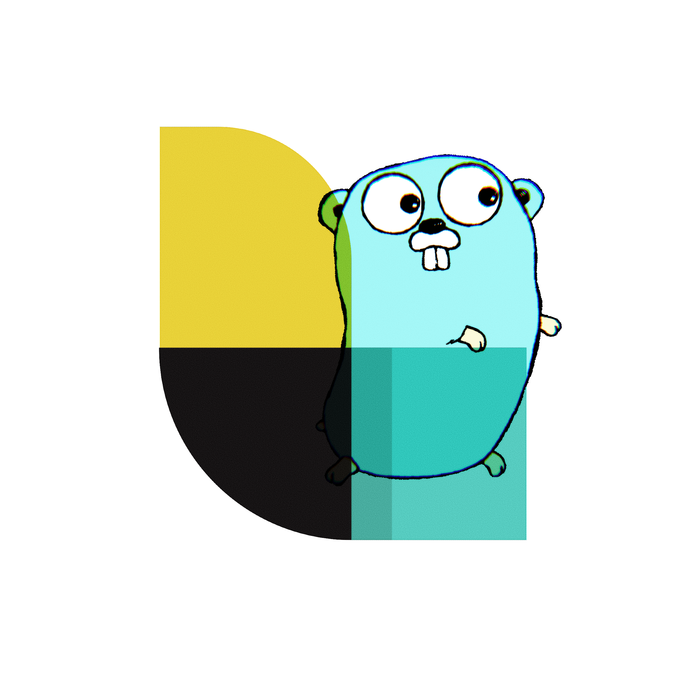

<div align="center">
<h2>Go Stash</h2>
Logstash Client Library For Go

[](https://github.com/telkomdev/go-stash)
<br/><br/>

[](https://godoc.org/github.com/telkomdev/go-stash)
[](https://goreportcard.com/report/github.com/telkomdev/go-stash)
</div>

### Features


- Support `TLS` https://en.wikipedia.org/wiki/Transport_Layer_Security
- Support Golang's standar `Log` https://golang.org/pkg/log/
- Support `Logrus` https://github.com/sirupsen/logrus

### Example

- [Basic](#basic)
- [With Golang's Standar Log](#with-golang-is-standar-log)
- [TLS](#tls-to-secure-your-connection)


### Install

```shell
$ go get github.com/telkomdev/go-stash
```


### Usage

#### Basic

```go
package main

import (
	"encoding/json"
	"fmt"
	"os"
	"time"

	"github.com/telkomdev/go-stash"
)

type Message struct {
	Data string `json:"data"`
}

type Log struct {
	Action  string    `json:"action"`
	Time    time.Time `json:"time"`
	Message Message   `json:"message"`
}

func main() {
    var host string = "localhost"
	var port uint64 = 5000
	s, err := stash.Connect(host, port)
	if err != nil {
		fmt.Println(err)
		os.Exit(1)
	}

	defer func() {
		s.Close()
	}()

	logData := Log{
			Action: "get_me",
			Time:   time.Now(),
			Message: Message{
				Data: "get me for me",
			},
		}

    logDataJSON, _ := json.Marshal(logData)

    n, err := s.Write(logDataJSON)
    if err != nil {
        fmt.Fprintf(w, err.Error())
        return
    }
}

```

#### With Golang is Standar Log
You can use `go-stash` With Golang's standar Log

```go
package main

import (
	"encoding/json"
	"fmt"
	"log"
	"os"
	"time"

	"github.com/telkomdev/go-stash"
)

type Message struct {
	Data string `json:"data"`
}

type Log struct {
	Action  string    `json:"action"`
	Time    time.Time `json:"time"`
	Message Message   `json:"message"`
}

func main() {
	var host string = "localhost"
	var port uint64 = 5000
	s, err := stash.Connect(host, port)
	if err != nil {
		fmt.Println(err)
		os.Exit(1)
	}

	defer func() {
		s.Close()
	}()

	logger := log.New(s, "", 0)

	logData := Log{
		Action: "get_me",
		Time:   time.Now(),
		Message: Message{
			Data: "get me for me",
		},
	}

	logDataJSON, _ := json.Marshal(logData)

	logger.Print(string(logDataJSON))

}

```

#### TLS to secure your connection
Sometimes you have to secure your communication between your `Logstash` and your client

```go
func main() {
	cert, err := tls.LoadX509KeyPair("certs/server.crt", "certs/server.key")
	if err != nil {
		log.Fatalf("server: loadkeys: %s", err)
		os.Exit(1)
	}
	config := tls.Config{Certificates: []tls.Certificate{cert}}

	var (
		host string = "localhost"
		port uint64 = 5000
	)

	s, err := stash.Connect(host, port, stash.SetTLSConfig(&config), stash.SetTLS(true))
	if err != nil {
		fmt.Println(err)
		os.Exit(1)
	}

	defer func() {
		s.Close()
	}()

	logger := log.New(s, "", 0)
```
